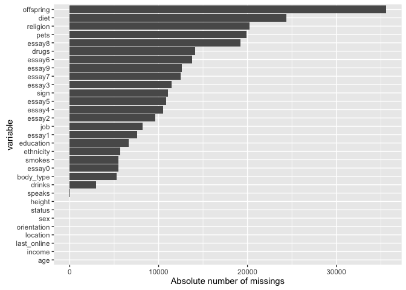
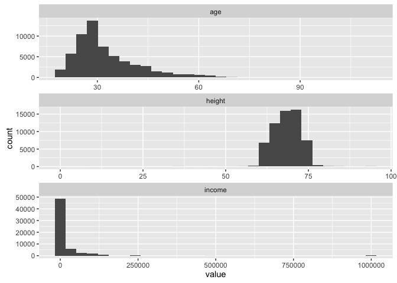
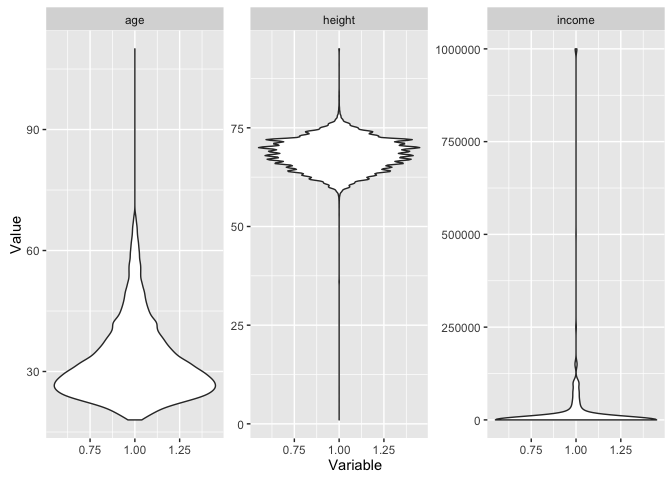
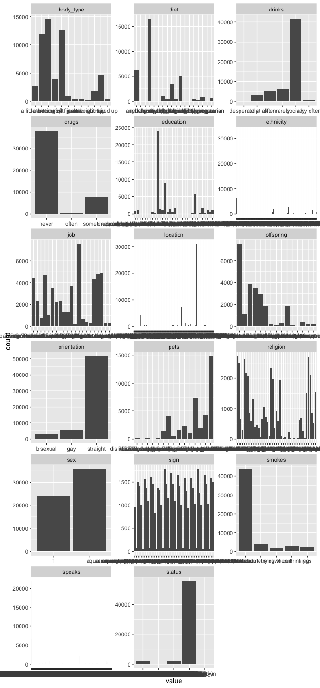

Checklist\_for\_Data\_Cleansing
================
Sebastian Sauer
9 August 2016

What this post is about: Data cleansing in practice with R
==========================================================

Data analysis, in practice, consists typically of some different steps which can be subsumed as "preparing data" and "model data" (not considering communication here):


(Inspired by [this](http://r4ds.had.co.nz/introduction-1.html))

Often, the first major part -- "prepare" -- is the most time consuming. This can be lamented since many analysts prefer the cool modeling aspects (since I want to show my math!). In practice, one rather has to get his (her) hands dirt...

In this post, I want to put together some kind of checklist of frequent steps in data preparation. More precisely, I would like to detail some typical steps in "cleansing" your data. Such steps include:

------------------------------------------------------------------------

-   \[x\] identify missings
-   \[x\] identify outliers
-   \[x\] check for overall plausibility and errors (e.g, typos)
-   \[x\] identify highly correlated variables
-   \[x\] identify variables with (nearly) no variance
-   \[x\] identify variables with strange names or values
-   \[x\] check variable classes (eg. characters vs factors)
-   \[x\] remove/transform some variables (maybe your model does not like categorial variables)
-   \[x\] rename some variables or values (especially interesting if large number)
-   \[x\] check some overall pattern (statistical/ numerical summaries)
-   \[x\] center/scale variables

------------------------------------------------------------------------

Don't get lost in big projects
==============================

Before we get in some details, let's consider some overall guidelines. I have noticed that some projects keep growing like weed, and I find myself bewildered in some jungle... The difficulties then arise not because data or models are difficult, but due to the sheer volume of the analysis.

All in a function
-----------------

Put analytical steps which belong together in one function. For example, build one function for data cleansing, give as input the raw data frame and let it spit out the processed data frame after all your cleansing steps:

``` r
cleansed_data <- cleanse_data(raw_dirty_data,
                              step_01 = TRUE,
                              step_02 = TRUE,
                              step_03 = TRUE)
```

Although functions are a bit more difficult to debug, at the end of the day it is much easier. Normally or often the steps will be run many times (for different reasons), so it is much easier if all is under one roof.

That said, [pragmtic programming](http://blog.sukria.net/2012/01/06/the-10-rules-of-the-pragmatic-programmer/) suggests to start easy, and to refactor frequently. So better start with a simple solution that works than to have a enormous code that chokes. Get the code running, then improve on it.

Data set for practice
=====================

The **OKCupid** Data set (sanitized version, no names!) is quite nice. You can download it [here](https://github.com/rudeboybert/JSE_OkCupid).

In the following, I will assume that these data are loaded.

``` r
library(readr)

path <- "/Users/sebastiansauer/Documents/OneDrive/Literatur/Methoden_Literatur/Datensaetze/JSE_OkCupid/"

file <- "profiles.csv"

data <- read_csv(paste(path, file, sep = ""))
```

    ## Parsed with column specification:
    ## cols(
    ##   .default = col_character(),
    ##   age = col_integer(),
    ##   height = col_integer(),
    ##   income = col_integer()
    ## )

    ## See spec(...) for full column specifications.

So, the data set is quite huge: 59946, 31 (rows/cols)

Let's have a brief look at the data.

``` r
library(dplyr)
```

    ## 
    ## Attaching package: 'dplyr'

    ## The following objects are masked from 'package:stats':
    ## 
    ##     filter, lag

    ## The following objects are masked from 'package:base':
    ## 
    ##     intersect, setdiff, setequal, union

``` r
glimpse(data)
```

    ## Observations: 59,946
    ## Variables: 31
    ## $ age         <int> 22, 35, 38, 23, 29, 29, 32, 31, 24, 37, 35, 28, 24...
    ## $ body_type   <chr> "a little extra", "average", "thin", "thin", "athl...
    ## $ diet        <chr> "strictly anything", "mostly other", "anything", "...
    ## $ drinks      <chr> "socially", "often", "socially", "socially", "soci...
    ## $ drugs       <chr> "never", "sometimes", NA, NA, "never", NA, "never"...
    ## $ education   <chr> "working on college/university", "working on space...
    ## $ essay0      <chr> "about me:<br />\n<br />\ni would love to think th...
    ## $ essay1      <chr> "currently working as an international agent for a...
    ## $ essay2      <chr> "making people laugh.<br />\nranting about a good ...
    ## $ essay3      <chr> "the way i look. i am a six foot half asian, half ...
    ## $ essay4      <chr> "books:<br />\nabsurdistan, the republic, of mice ...
    ## $ essay5      <chr> "food.<br />\nwater.<br />\ncell phone.<br />\nshe...
    ## $ essay6      <chr> "duality and humorous things", NA, NA, "cats and g...
    ## $ essay7      <chr> "trying to find someone to hang out with. i am dow...
    ## $ essay8      <chr> "i am new to california and looking for someone to...
    ## $ essay9      <chr> "you want to be swept off your feet!<br />\nyou ar...
    ## $ ethnicity   <chr> "asian, white", "white", NA, "white", "asian, blac...
    ## $ height      <int> 75, 70, 68, 71, 66, 67, 65, 65, 67, 65, 70, 72, 72...
    ## $ income      <int> -1, 80000, -1, 20000, -1, -1, -1, -1, -1, -1, -1, ...
    ## $ job         <chr> "transportation", "hospitality / travel", NA, "stu...
    ## $ last_online <chr> "2012-06-28-20-30", "2012-06-29-21-41", "2012-06-2...
    ## $ location    <chr> "south san francisco, california", "oakland, calif...
    ## $ offspring   <chr> "doesn&rsquo;t have kids, but might want them", "d...
    ## $ orientation <chr> "straight", "straight", "straight", "straight", "s...
    ## $ pets        <chr> "likes dogs and likes cats", "likes dogs and likes...
    ## $ religion    <chr> "agnosticism and very serious about it", "agnostic...
    ## $ sex         <chr> "m", "m", "m", "m", "m", "m", "f", "f", "f", "m", ...
    ## $ sign        <chr> "gemini", "cancer", "pisces but it doesn&rsquo;t m...
    ## $ smokes      <chr> "sometimes", "no", "no", "no", "no", "no", NA, "no...
    ## $ speaks      <chr> "english", "english (fluently), spanish (poorly), ...
    ## $ status      <chr> "single", "single", "available", "single", "single...

What's in a name?
-----------------

With the code getting longer, it is easy to get confused about naming: `data_v2_no_missings_collapsed` is the right data matrix to proceed, wasn't it? Or rather `data_dat_edit_noNA_v3`? Probably a helpful (though partial) solution is to prevent typing a lot. "Don't repeat yourself" - if stuff is put inside a function, the objects will not clutter your environment, and you don't have to deal with them all the time. Also, you will reduce code, and the number of objects if stuff is put inside functions and loops.

That raises the question who to name the data set? At least two points are worth thinking. First, the "root" name should it be the name of the project such as "OKCupid" or "nycflights13"? Or just something like "data"? Personally, I prefer "data" as it is short and everybody will know what's going on. Second question: Should some data manipulations should be visible in the name of the object? I, personally, like this and do that frequently, eg., `carat_mean`, so I will remember that the mean is in there. However, for bigger projects I have made the experience that I lose track on which is the most recent version. So better do *not* put data manipulations in the name of the data frame. However, what one can do is use attributes, eg.:

``` r
data_backup <- removing_missings(data)
data <- data_backup

attr(data, "NA_status") <- "no_NA"
```

Checklist
=========

Clearly, there are different ways to get to Rome; I present just one, which has proved helpful for me.

Identify missings
-----------------

A key point is here to address many columns in one go, otherwise it gets laborious with large data sets. Here's one way:

``` r
library(knitr)

data %>% 
  summarise_all(funs(sum(is.na(.)))) %>% kable
```

|  age|  body\_type|   diet|  drinks|  drugs|  education|  essay0|  essay1|  essay2|  essay3|  essay4|  essay5|  essay6|  essay7|  essay8|  essay9|  ethnicity|  height|  income|   job|  last\_online|  location|  offspring|  orientation|   pets|  religion|  sex|   sign|  smokes|  speaks|  status|
|----:|-----------:|------:|-------:|------:|----------:|-------:|-------:|-------:|-------:|-------:|-------:|-------:|-------:|-------:|-------:|----------:|-------:|-------:|-----:|-------------:|---------:|----------:|------------:|------:|---------:|----:|------:|-------:|-------:|-------:|
|    0|        5296|  24395|    2985|  14080|       6628|    5485|    7571|    9638|   11476|   10537|   10847|   13771|   12450|   19214|   12602|       5680|       3|       0|  8198|             0|         0|      35561|            0|  19921|     20226|    0|  11056|    5512|      50|       0|

The function `kable` prints a html table (package `knitr`).

There seem to be quite a bit missings. Maybe better plot it.

``` r
library(ggplot2)
library(tidyr)

data %>% 
  summarise_all(funs(sum(is.na(.)))) %>% 
  gather %>% 
  ggplot(aes(x = reorder(key, value), y = value)) + geom_bar(stat = "identity") +
  coord_flip() +
  xlab("variable") +
  ylab("Absolute number of missings")
```



With this large number of missings, we probably will not find an easy solution. Skipping cases will hurt, but imputating may also not be appropriate. Ah, now I know: Let's just leave it as it is for the moment :-)

Or, at least let's remember which columns have more than, say, 10%, missings:

``` r
cols_with_some_NA <- round(colMeans(is.na(data)),2)
cols_with_too_many_NA <- cols_with_some_NA[cols_with_some_NA > .1]

# alterntively:
data %>% 
  select_if(function(col) mean(is.na(col)) < .1)
```

    ## # A tibble: 59,946 x 14
    ##      age      body_type     drinks
    ##    <int>          <chr>      <chr>
    ## 1     22 a little extra   socially
    ## 2     35        average      often
    ## 3     38           thin   socially
    ## 4     23           thin   socially
    ## 5     29       athletic   socially
    ## 6     29        average   socially
    ## 7     32            fit   socially
    ## 8     31        average   socially
    ## 9     24           <NA>   socially
    ## 10    37       athletic not at all
    ## # ... with 59,936 more rows, and 11 more variables: essay0 <chr>,
    ## #   ethnicity <chr>, height <int>, income <int>, last_online <chr>,
    ## #   location <chr>, orientation <chr>, sex <chr>, smokes <chr>,
    ## #   speaks <chr>, status <chr>

OK, that are `length(cols_with_too_many_NA)` columns. We would not want to exclude them because they are too many.

Identify outliers
-----------------

Obviously, that's a story for numeric variable only. So let's have a look at them first.

``` r
data %>% 
  select_if(is.numeric) %>% names
```

    ## [1] "age"    "height" "income"

Histograms are a natural and easy way to spot them and to learn something about the distribution.

``` r
data %>% 
  select_if(is.numeric) %>% 
  gather %>% 
  ggplot(aes(x = value)) + facet_wrap(~ key, scales = "free", nrow = 3) +
  geom_histogram()
```

    ## `stat_bin()` using `bins = 30`. Pick better value with `binwidth`.

    ## Warning: Removed 3 rows containing non-finite values (stat_bin).



Especially `income` may be problematic.

Find out more on `gather` eg., [here](https://sebastiansauerblog.wordpress.com/2016/07/13/long-vs-wide-format-and-gather/).

Box plots (or violin plots/bean plots) may also be a way:

``` r
data %>% 
  select_if(is.numeric) %>% 
  gather %>% 
  ggplot(aes(x = 1, y = value)) + facet_wrap(~ key, scales = "free") + 
  geom_violin() +
  ylab("Value") +
  xlab("Variable")
```

    ## Warning: Removed 3 rows containing non-finite values (stat_ydensity).



Identify variables with unique values
-------------------------------------

Similar to outliers, for categorical variable we can look whether some values are seldom, e.g, only 0.1% of the times. What "often" or "barely" is, depends on ... you!

``` r
library(purrr)
```

    ## 
    ## Attaching package: 'purrr'

    ## The following objects are masked from 'package:dplyr':
    ## 
    ##     contains, order_by

``` r
data %>% 
  select_if(negate(is.numeric)) %>% 
  select(-matches("essay")) %>% 
  select(-last_online) %>% 
  gather %>% 
  ggplot(aes(x = value)) + geom_bar() + 
  facet_wrap(~ key, scales = "free", ncol = 3) 
```

    ## Warning: Removed 159588 rows containing non-finite values (stat_count).



Pooh, that takes ages to plot. Maybe better don't plot, since we are not after exploration, but just want to know if something is going wrong.

Maybe it is better if we do the following: &gt; for each non-numeric variable do &gt; divide most frequent category by least frequent category

This gives an indication whether some categories are quite frequent in relation to others.

``` r
data %>% 
  select_if(is.character) %>% 
  summarise_each(funs(max(table(.)/(min(table(.)))))) %>% 
  arrange %>% 
  kable
```

|  body\_type|      diet|    drinks|     drugs|  education|  essay0|  essay1|  essay2|  essay3|  essay4|  essay5|  essay6|  essay7|  essay8|  essay9|  ethnicity|       job|  last\_online|  location|  offspring|  orientation|      pets|  religion|       sex|      sign|    smokes|  speaks|  status|
|-----------:|---------:|---------:|---------:|----------:|-------:|-------:|-------:|-------:|-------:|-------:|-------:|-------:|-------:|-------:|----------:|---------:|-------------:|---------:|----------:|------------:|---------:|---------:|---------:|---------:|---------:|-------:|-------:|
|          74|  1507.727|  129.7516|  92.00976|   2178.091|      12|      61|      82|     529|      16|       6|     161|      89|      45|     199|      32831|  37.20098|            24|     31064|        360|     18.65052|  336.6818|  209.5385|  1.485632|  43.46341|  29.65946|   21828|  5569.7|

Plausibility check
------------------

Plausibility check can includes checking orders of magnitude, looking for implausible values (negative body weight), among others. A good starter is to differentiate between numeric and non-numeric variables.

### Numeric

``` r
data %>% 
  select_if(is.numeric) %>% 
  map(summary)
```

    ## $age
    ##    Min. 1st Qu.  Median    Mean 3rd Qu.    Max. 
    ##   18.00   26.00   30.00   32.34   37.00  110.00 
    ## 
    ## $height
    ##    Min. 1st Qu.  Median    Mean 3rd Qu.    Max.    NA's 
    ##     1.0    66.0    68.0    68.3    71.0    95.0       3 
    ## 
    ## $income
    ##    Min. 1st Qu.  Median    Mean 3rd Qu.    Max. 
    ##      -1      -1      -1   20030      -1 1000000

The function `map` comes from package `purrr`; it maps each selected column to the function `summary`.

For instance, the max. age of 110 appears somewhat high... And the min. height of 1 should rather be excluded before further operations start. For `income` similar reasoning applies.

### Non-numeric

Let's do not look at all these `essay` variables here, because "strange" values are not so straight forward to identify compared to more normal categorical variables (with less distinct values).

``` r
data %>% 
  select(-matches("essay")) %>% 
  select_if(is.character) %>% 
  mutate_all(factor) %>% 
  map(summary)
```

*Output truncated, TL;DR*

We need to convert to `factor` because for `character` variables, no nice `summary` is available of the shelf.

Highly correlated variables
---------------------------

``` r
data %>% 
  select_if(is.numeric) %>% 
  cor
```

    ##                age height      income
    ## age     1.00000000     NA -0.00100384
    ## height          NA      1          NA
    ## income -0.00100384     NA  1.00000000

Constants/ near zero variance variables
---------------------------------------

Applies to numeric variables obviously.

``` r
data %>% 
  select_if(is.numeric) %>% 
  na.omit %>% 
  summarise_all(c("sd", "IQR"))
```

    ## # A tibble: 1 x 6
    ##     age_sd height_sd income_sd age_IQR height_IQR income_IQR
    ##      <dbl>     <dbl>     <dbl>   <dbl>      <dbl>      <dbl>
    ## 1 9.452723  3.994803  97348.52      11          5          0

Rename many variables
---------------------

``` r
ncol_data <- ncol(data) 
names_data_new <- paste("V",1:ncol_data, sep = "")
dummy <- data
names(dummy) <- names_data_new
```

Recode values
-------------

A quite frequent use case is to get "strange" value or variables names in order, e.g., "variable 2" or "I rather not say" (including blanks or some other non-normal stuff).

One approach is to use `dplyr::recode`.

``` r
dplyr::distinct(data, body_type)
```

    ## # A tibble: 13 x 1
    ##         body_type
    ##             <chr>
    ## 1  a little extra
    ## 2         average
    ## 3            thin
    ## 4        athletic
    ## 5             fit
    ## 6            <NA>
    ## 7          skinny
    ## 8           curvy
    ## 9    full figured
    ## 10         jacked
    ## 11 rather not say
    ## 12        used up
    ## 13     overweight

``` r
dummy <- dplyr::recode(data$body_type, `a little extra` = "1")
unique(dummy)
```

    ##  [1] "1"              "average"        "thin"           "athletic"      
    ##  [5] "fit"            NA               "skinny"         "curvy"         
    ##  [9] "full figured"   "jacked"         "rather not say" "used up"       
    ## [13] "overweight"

A second approach is to use `base::levels` for factors.

``` r
dummy <- data$body_type 
dummy <- factor(dummy)
levels(dummy)
```

    ##  [1] "a little extra" "athletic"       "average"        "curvy"         
    ##  [5] "fit"            "full figured"   "jacked"         "overweight"    
    ##  [9] "rather not say" "skinny"         "thin"           "used up"

``` r
levels(dummy) <- 1:12
levels(dummy)
```

    ##  [1] "1"  "2"  "3"  "4"  "5"  "6"  "7"  "8"  "9"  "10" "11" "12"

I don not use `plyr:mapvalues` because `plyr` can interfere with `dplyr` (and `dplyr` seems more helpful to me).

Center/ scale variables
-----------------------

As often, several approaches. One is:

``` r
data %>% 
  select_if(is.numeric) %>% 
  scale() %>% 
  head
```

    ##             age      height        income
    ## [1,] -1.0938888  1.67836042 -0.2058038645
    ## [2,]  0.2813681  0.42673429  0.6160156465
    ## [3,]  0.5987351 -0.07391616 -0.2058038645
    ## [4,] -0.9880998  0.67705952 -0.0003412823
    ## [5,] -0.3533659 -0.57456662 -0.2058038645
    ## [6,] -0.3533659 -0.32424139 -0.2058038645

`base::scale` performs a z-transformation of the matrix (like object) given as input.

But wait; one issue is that the data frame now consists of the numeric variables only. We have to manually knit it together with the rest of the party. Not so convenient. Rather, try this:

``` r
data %>% 
  select(-matches("essay")) %>% 
  mutate_if(is.numeric, scale) %>% 
  glimpse
```

    ## Observations: 59,946
    ## Variables: 21
    ## $ age         <dbl> -1.09388884, 0.28136809, 0.59873508, -0.98809985, ...
    ## $ body_type   <chr> "a little extra", "average", "thin", "thin", "athl...
    ## $ diet        <chr> "strictly anything", "mostly other", "anything", "...
    ## $ drinks      <chr> "socially", "often", "socially", "socially", "soci...
    ## $ drugs       <chr> "never", "sometimes", NA, NA, "never", NA, "never"...
    ## $ education   <chr> "working on college/university", "working on space...
    ## $ ethnicity   <chr> "asian, white", "white", NA, "white", "asian, blac...
    ## $ height      <dbl> 1.67836042, 0.42673429, -0.07391616, 0.67705952, -...
    ## $ income      <dbl> -0.2058038645, 0.6160156465, -0.2058038645, -0.000...
    ## $ job         <chr> "transportation", "hospitality / travel", NA, "stu...
    ## $ last_online <chr> "2012-06-28-20-30", "2012-06-29-21-41", "2012-06-2...
    ## $ location    <chr> "south san francisco, california", "oakland, calif...
    ## $ offspring   <chr> "doesn&rsquo;t have kids, but might want them", "d...
    ## $ orientation <chr> "straight", "straight", "straight", "straight", "s...
    ## $ pets        <chr> "likes dogs and likes cats", "likes dogs and likes...
    ## $ religion    <chr> "agnosticism and very serious about it", "agnostic...
    ## $ sex         <chr> "m", "m", "m", "m", "m", "m", "f", "f", "f", "m", ...
    ## $ sign        <chr> "gemini", "cancer", "pisces but it doesn&rsquo;t m...
    ## $ smokes      <chr> "sometimes", "no", "no", "no", "no", "no", NA, "no...
    ## $ speaks      <chr> "english", "english (fluently), spanish (poorly), ...
    ## $ status      <chr> "single", "single", "available", "single", "single...

If we only want to center (or something similar), we could do

``` r
data %>% 
  mutate_if(is.numeric, funs(. - mean(.)))
```

    ## # A tibble: 59,946 x 31
    ##            age      body_type              diet     drinks     drugs
    ##          <dbl>          <chr>             <chr>      <chr>     <chr>
    ## 1  -10.3402896 a little extra strictly anything   socially     never
    ## 2    2.6597104        average      mostly other      often sometimes
    ## 3    5.6597104           thin          anything   socially      <NA>
    ## 4   -9.3402896           thin        vegetarian   socially      <NA>
    ## 5   -3.3402896       athletic              <NA>   socially     never
    ## 6   -3.3402896        average   mostly anything   socially      <NA>
    ## 7   -0.3402896            fit strictly anything   socially     never
    ## 8   -1.3402896        average   mostly anything   socially     never
    ## 9   -8.3402896           <NA> strictly anything   socially      <NA>
    ## 10   4.6597104       athletic   mostly anything not at all     never
    ## # ... with 59,936 more rows, and 26 more variables: education <chr>,
    ## #   essay0 <chr>, essay1 <chr>, essay2 <chr>, essay3 <chr>, essay4 <chr>,
    ## #   essay5 <chr>, essay6 <chr>, essay7 <chr>, essay8 <chr>, essay9 <chr>,
    ## #   ethnicity <chr>, height <dbl>, income <dbl>, job <chr>,
    ## #   last_online <chr>, location <chr>, offspring <chr>, orientation <chr>,
    ## #   pets <chr>, religion <chr>, sex <chr>, sign <chr>, smokes <chr>,
    ## #   speaks <chr>, status <chr>

That's it; happy analyzing!
